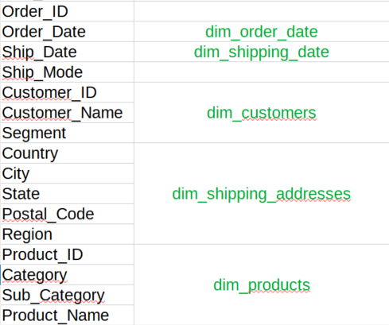
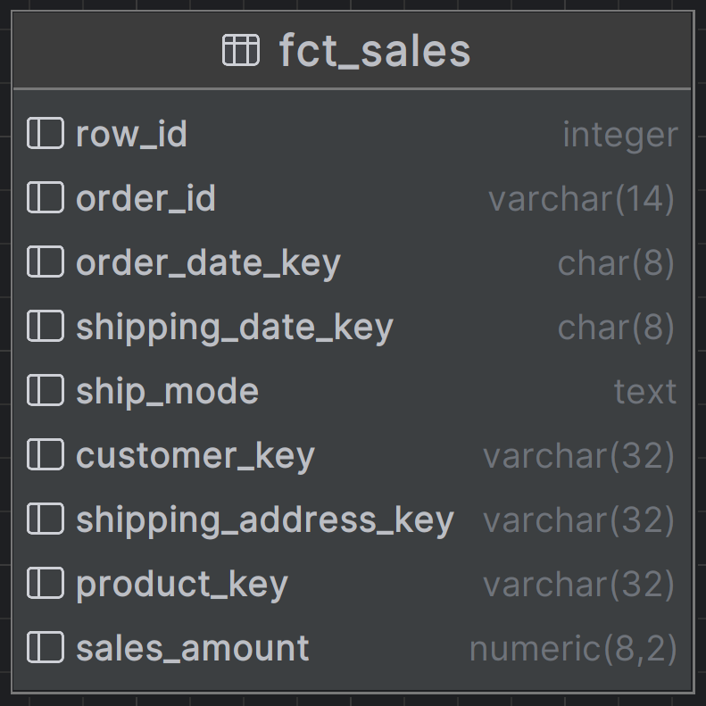
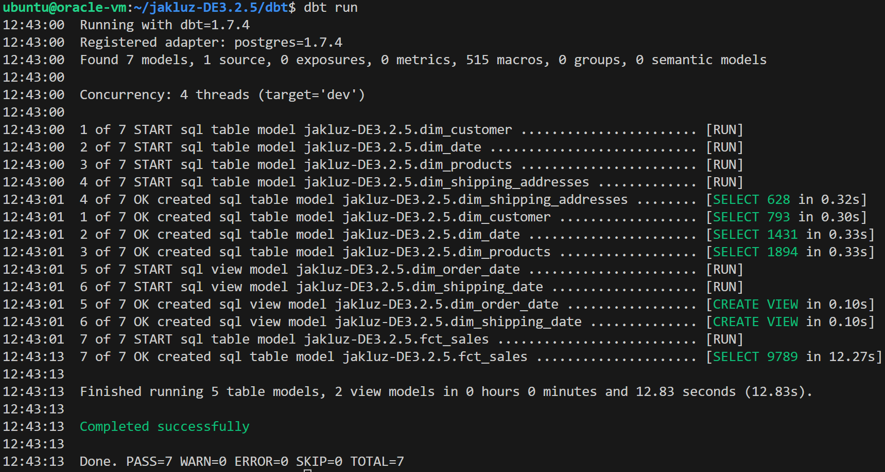
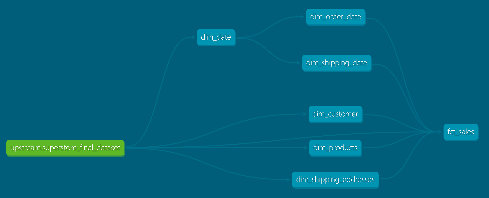

## Portfolio project
# Data Modeling with dbt & Analytics Engineering

This is repository for Turing College Data Engineering course Module 3 Sprint 2 Part 5 - **Data Modeling with dbt & Analytics Engineering** by Jakub Kluz.

The purpose of this project is to practice using dbt and Docker, as well as practice dimensional modeling as a complimentary excercise to "The Data Warehouse Toolkit: The Definitive Guide to Dimensional Modeling" book by the esteemed authors Ralph Kimball and Margy Ross. The dataset that I am working with is [Superstore Sales from Kaggle](https://www.kaggle.com/datasets/bhanupratapbiswas/superstore-sales) by Bhanupratap Biswas.

# Environment
I am developing on GNU/Linux Ubuntu 22.04 Server Edition using Oracle Free Tier ARM64 machine VM.Standard.A1.Flex with 4 ARM cores and 24 GB of RAM. The machine is working beautifuly for me for the whole Turing College course. Some other parts of my environment include:

* Docker 24.05 from the Ubuntu repository along with Docker Compose 1.29.2 as a plugin (not yet integrated into Docker - it has happened in the following versions),
* PostgreSQL 16.1 from Docker Hub, image `postgres:16.1`,
* Adminer 4.8.1 from Docker Hub, image `adminer:4.8.1`,
* dbt-postgres 1.7.4 from [GitHub packages](https://github.com/dbt-labs/dbt-core/pkgs/container/dbt-postgres), used as a Docker container,
* DataGrip 2023.3.1 from JetBrains. What a relief it is to work with a proper quality database-centric and user-friendly (I am looking at you, Adminer!) environment. If only there would be support for dbt, it would be bananas, however it will likely never happen - it is conceptually very different.

I am developing with Visual Studio Code with Remote SSH connection to the Oracle machine.

## PostgreSQL
With every consecutive project I change my working concept a little bit, this time I have decided to add a per-project schema:
```sql
create schema "jakluz-DE3.2.5";

comment on schema "jakluz-DE3.2.5" is 'Schema for DE3.2.5 project "Data Modeling with dbt & Analytics Engineering" at Turing College';

alter schema "jakluz-DE3.2.5" owner to turing;
```

to store objects, that I work with for this project. Now I have a separate `turing` database for Turing College projects, separate `turing` user that owns the database, and a separate `jakluz-DE3.2.5` schema for this project alone. I wonder what will I come up with next.

## dbt
Using dbt in Docker is a requirement, so I need to make it working.

### dbt environment in Docker
Since I work in ARM environment, the extra step I needed to take is building image for ARM architecture, that is not provided by default by dbt-labs. I have downloaded the [Dockerfile](https://github.com/dbt-labs/dbt-core/blob/main/docker/Dockerfile) and followed the [README](https://github.com/dbt-labs/dbt-core/blob/main/docker/README.md) instructions. I have build Docker image with a command:
```bash
docker build --tag dbt --target dbt-postgres --build-arg build_for=linux/arm64 --build-arg dbt_postgres_ref=dbt-core@v1.7.4 .
```

within [catalog](docker/dbt/), that had the `Dockerfile` inside. That created a nice `dbt` image that I could run on my environment.

Then I aliased the command:
```bash
docker run --mount type=bind,source=/home/ubuntu/jakluz-DE3.2.5/dbt,target=/usr/app --mount type=bind,source=/home/ubuntu/.dbt,target=/root/.dbt dbt
```

that lets me use the Docker image almost as if I would have it locally installed. The alias is available in a [file](bash_dbt_alias), that I can source at the beggining of the coding session with:
```bash
source bash_dbt_alias
```

so I can run dbt with Docker almost as easily as I would do it with local install.

## Jumpstarting the project
I have jumpstarted the dbt project with `dbt init` in [dbt/](dbt/), that will act as a project root with suitable connection configuration to my PostgreSQL database, that I use throughout my Data Engineering Turing Course. I had to tweak the resulting configuration a bit with respect to naming, since dbt doesn't seem to like special characters. I have also removed the example resources, kindly provided by dbt-labs as a reference. It was very helpful indeed and I used it as a starting point.

# Extract and load
That part is more tricky, than it seems at glance. The dataset was converted from ANSI encoding to UTF-8 in Notepad++, since there is not really an option to configure the codec for the `dbt seed` tool that I intended to use. I have also changed the file name to get rid of very ugly suffix and put it in [dbt project seed catalog](dbt/seeds/superstore_final_dataset.csv). Then I ingested the file into the database as-is in a true ELT fasion with `dbt seed`. It took 35,44s to load 9800 rows. I actually expected the process to take miliseconds. It actually seems, that folks at dbt-labs was right about [seeds not being really performant](https://docs.getdbt.com/docs/build/seeds#faqs). However, 9800 rows is rather far for being Big Data, I decided it is good enought to use this handy tool. It is worth noting, that dbt does just as bad job with database types guessing as Pandas does. My hopes were really high in this regard, considering it is a modern and hyped tool. There is room for improvement, however I somewhat understand the safe choice of the conservative types.

# Data modeling
The dataset is not really well documented, but since I need to make sense of it, I made several assumtions:
* the products are shipped by a store to the customer,
* products in a single order might be shipped to different addresses,
* customers might have different shipping addressess as well.

## Kimball's Four Step Process
Since weeks of coding can save hours of thinking, and I don't have weeks for coding, let's start with thinking and do the conceptual work. I will do my best to follow the [Kimball's Four Step Process](https://www.holistics.io/books/setup-analytics/kimball-s-dimensional-data-modeling/) for data modeling.

1. **Pick a business process to model.** I don't have much choice here. The data describes sales process, so that is the process I intend to pick.
2. **Decide on the grain.** Following the suggestions from the esteemed Ralph Kimball himself, the grain should be the line item, so I will be based on "Product_ID" column - it will be a single product in order.
3. **Chose the dimensions that apply to each fact table row.** I have identified the following row dimensions (green) with fields (black):



4. **Identify the numeric facts that will populate each fact table row.** I have identified a single numeric fact, namely the Sales column that supposedly stores the amount of cash (dollars p'haps) the product costs with this order.

Of course I intend to use surrogate keys for the dimension tables, and reference them in the fact table.

## Dimensional model implementation in dbt
I have decided to place my models in the [models/jakluz_de325](dbt/models/jakluz_de325/) catalog. I also don't see any point in scattering those few models now in some separate places. I have defined the seeded data in [sources file](dbt/models/jakluz_de325/sources.yml) and put short models descriptions in [schema file](dbt/models/jakluz_de325/schema.yml).

I also followed Kimball's suggestion about having a single [date](dbt/models/jakluz_de325/dim_date.sql) table for all the dates in the project, and constructing per-purpose date objects as views for [shipping dates](dbt/models/jakluz_de325/dim_shipping_date.sql) and [order dates](dbt/models/jakluz_de325/dim_order_date.sql).

I have decided not to ever alter the source data. To keep the model materializations groomed, I opted to cast the columns to a proper PostgreSQL column type at the importing level of each initial import CTE. It could be also done at a `dbt_project.yml` level, but I decided I like keeping the type definition closer to the data usage.

DataGrip rendered the dimension objects nicely for me:


Next I constructed the [fact table](dbt/models/jakluz_de325/fct_sales.sql) joining the surrogate keys from other tables via CTEs the the following result:



dbt shows me some logs with time measurements for different actions, that are quite interesting:



dbt also created some docs for me with `dbt docs serve`. The model flow diagram is particularly useful:



# Aknowledements
1. Kimball design methodology puts some emphasize on storing surrogate keys as an autoincrementing integer. This is rather hard when iteratively working with models, since the autoincrement on database level wouldn't start from 1 for later modeling iterations and it is discouraged by Claire, the former dbt labs employee, [here](https://discourse.getdbt.com/t/can-i-create-an-auto-incrementing-id-in-dbt/579/2). I decided to use the `generate_surrogate_key` from `dbt-utils` package, that generates surrogate key (that looks like an md5 hash) from defined columns as described in the [dbt docs](https://docs.getdbt.com/blog/sql-surrogate-keys).
2. dbt does not appear to support relationships between tables (primary-foreign keys), which was extremely strange for me. They state is is an informed decision [here](https://discourse.getdbt.com/t/does-dbt-add-primary-foreign-key-constraints/315) becuase their primary platforms are BigQuery, Snowflake and Redshift and some of them apparently do not support relationships - it has little value for OLAP, however things are slowly changing as per [this discussion](https://github.com/dbt-labs/dbt-core/issues/8062#issuecomment-1664643874) While I am fully aware, that PostgreSQL has relationships built in (probably) from start, I will not use those in this project.
3. It is really a pity, that dbt doesn't like on-prem Data Warehousing solutions and focuses on cloud technologies. They do provide Docker image for PostgreSQL, but it feels just like a pose not to look like they are cloud sales drivers. I really badly wanted to use a selfhosted version of ClickHouse for this project, but since there is not dbt-clickhouse Docker image and using Docker is a requirement, I figured it would be too time-consuming to build a custom Docker image with a ClickHouse driver (and I also admit I wanted to get straight into modeling). I intend to replicate this project with ClickHouse as well. I think ClickHouse would make a killer on-prem Data Warehouse if the company would like to invest in setting up and maintaining the ClickHouse infrastructure as well as the data would not be enormous.
4. The data documentation, that dbt is able to generate, is very useful and I can see it being one of the cornerstones of the Data Mesh concept - we can describe the dataset for the broad audience, thus making it understandable for everyone. This could greatly improve the Data Availability for an organization.